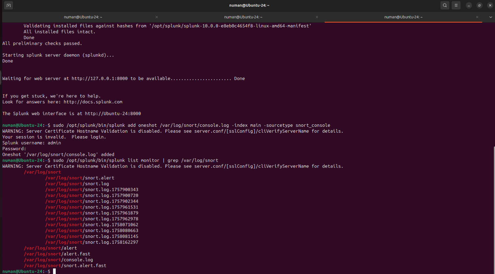

➤ [Full Lab Report](docs/REPORT.md) • [Dashboard XML](splunk/snort_portscan_overview.xml) • [Key SPL](scripts/queries/)

# Snort → Splunk Portscan Demo

This home-lab demonstrates how to detect **Nmap SYN scans** using **Snort** and visualize the alerts in **Splunk**.  
The setup includes a small but functional Splunk dashboard with panels for **top sources, top destination ports, timelines, and recent alerts**.  

---

## 🔍 What it shows
- Real-time `TCP Portscan Detected (SYN burst)` alerts from Snort  
- Parsed fields for **source IP, destination IP, protocol, ports, and priority**  
- A simple, readable **Splunk dashboard** for triage  

---

## 📂 Repository Structure
- `scripts/` – helper scripts to run Snort and add Splunk monitors  
- `splunk/` – XML export of the Splunk dashboard  
- `queries/` – SPL queries used by the panels  
- `docs/screenshots/` – screenshots for README and LinkedIn  

---

## ⚡ How to Run (Quick Start)
1. Start Snort on a host-only NIC and log output:  
   ```bash
   sudo ./scripts/run_snort_console.sh


## Screenshots

**Dashboard overview**


**Panels**

| Over time | Top sources | Top destination ports |
|---|---|---|
|  |  |  |

**Last 50 alerts**


**Live terminals**





