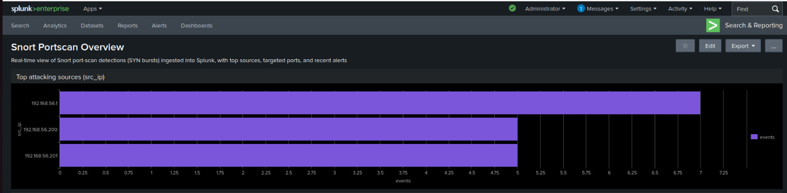
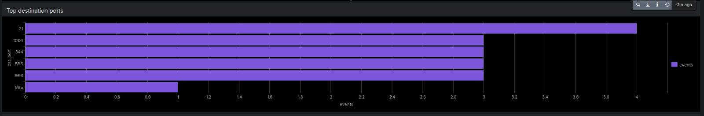
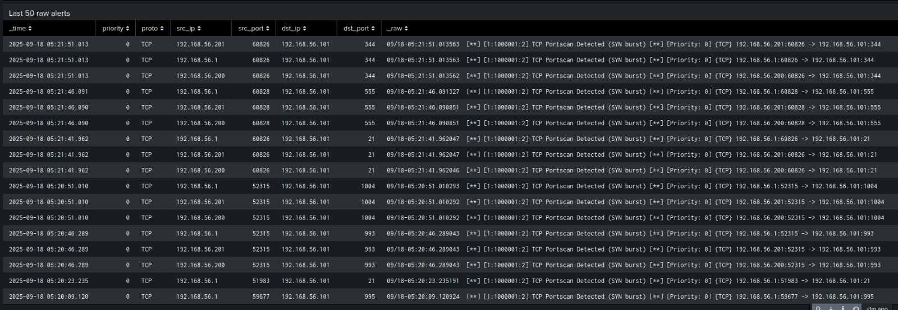
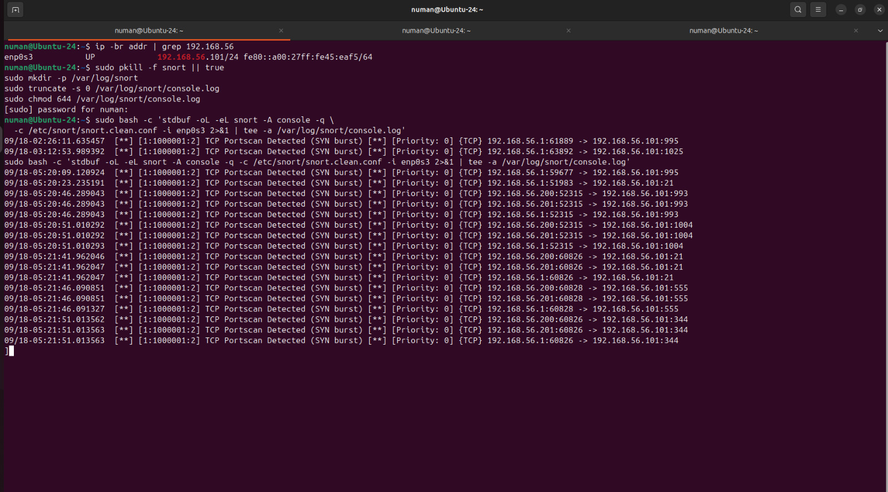
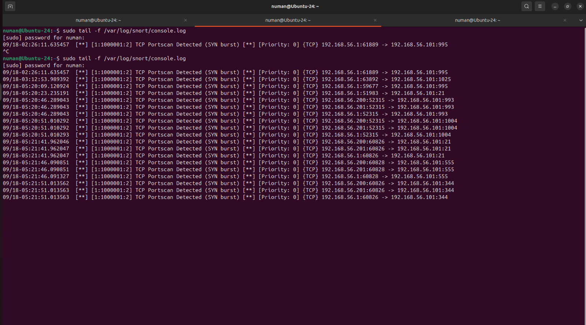

➤ [Full Lab Report](docs/REPORT.md) • [Dashboard XML](splunk/snort_portscan_overview.xml) • [Key SPL](scripts/queries/)

# Snort → Splunk Portscan Demo

Small home-lab that detects Nmap SYN scans with Snort and ships the alerts into Splunk.
Includes a minimal dashboard (top sources, top destination ports, timeline, last 50 alerts),
SPL queries, and helper scripts.

## What it shows
- Realtime “TCP Portscan Detected (SYN burst)” alerts
- Parsed IP/ports/proto/priority
- A small, readable Splunk dashboard

## Folders
- `scripts/` – start Snort and add Splunk monitors
- `splunk/` – dashboard XML export
- `queries/` – SPL used by the panels
- `docs/screenshots/` – screenshots for README/LinkedIn

## How to run (short)
1) Start Snort on host-only NIC and tee to console.log  
   `sudo ./scripts/run_snort_console.sh`
2) Add Splunk monitors (one-time)  
   `sudo ./scripts/add_splunk_inputs.sh`
3) Open Splunk → Search & Reporting and run the SPL in `queries/`.

## Screenshots

**Dashboard overview**

**Panels**

| Over time | Top sources | Top destination ports |
|---|---|---|
|  |  |  |

**Last 50 alerts**

**Live terminals**

