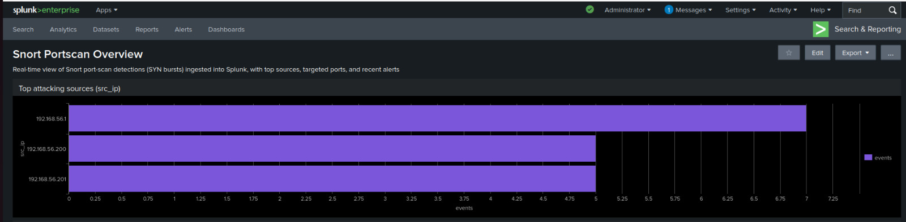
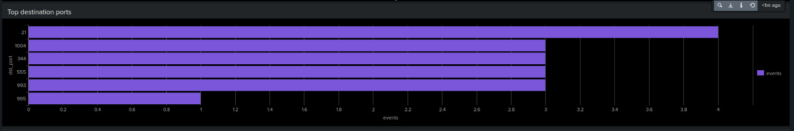
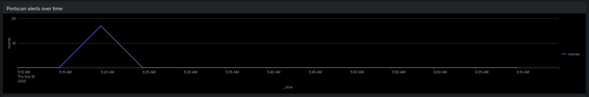
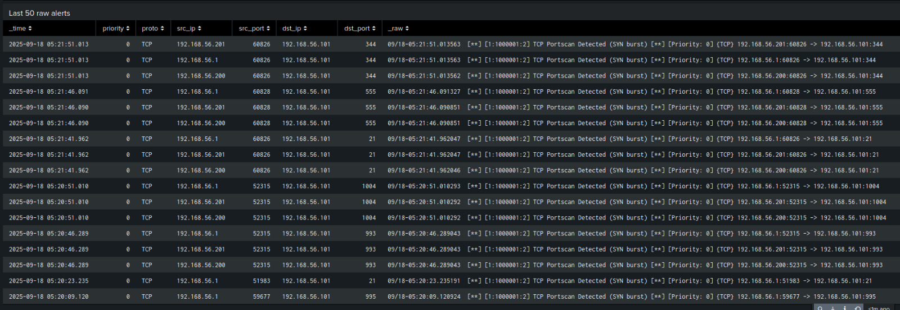
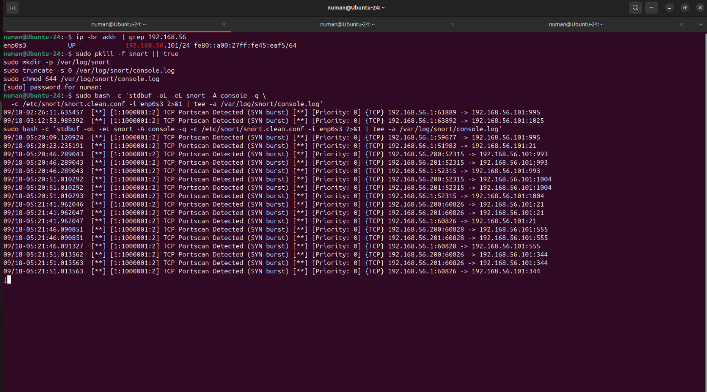
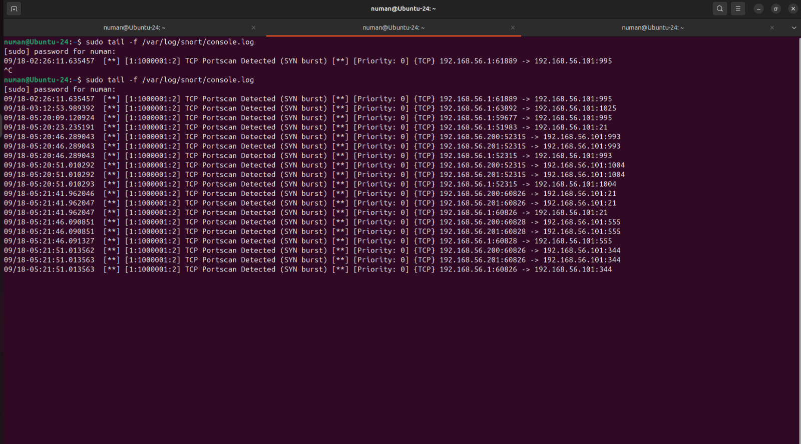
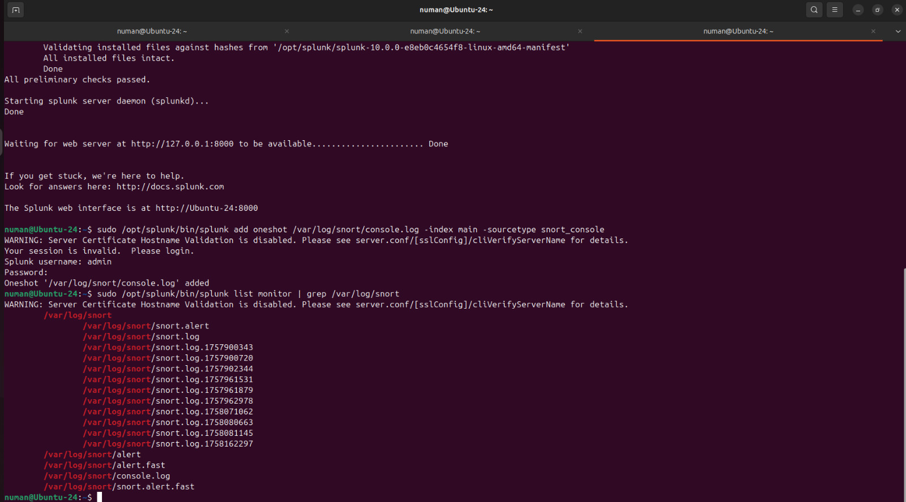

Lab-2: Snort -> Splunk Portscan Detection

Author: Numan Shaik
Repo: numanshaik-security/snort-splunk-portscan-demo
Date: 9/18/2025

1) Executive Summary

Built a mini detection pipeline that flags Nmap SYN portscans with Snort and streams alerts into Splunk in near-real time. Parsed key fields (src/dst IP, ports, proto, priority) and visualized activity with a lightweight dashboard (top sources, top ports, timeline, last 50 alerts).

2) Lab Topology
   
Attacker (Windows host) ──Nmap──▶ Ubuntu (Snort + Splunk)
   192.168.56.1                         192.168.56.101
            Host-only NIC (enp0s3, 192.168.56.0/24)
Snort listens on enp0s3 (host-only network).

Console output is duplicated to /var/log/snort/console.log via tee.

Splunk monitors that file (and alert.fast, optional) and ingests into index=main.

3) Tools & Versions

Ubuntu 24 (VirtualBox host-only)

Snort 2.9.x (SYN burst / portscan preproc enabled)

Splunk Enterprise 10.x

Nmap 7.98 (Windows)

4) Objective & Hypothesis

Objective: Detect fast SYN scans and generate triage-friendly Splunk panels.

Hypothesis: A bursty -sS scan will trigger Snort’s “TCP Portscan Detected (SYN burst)”; forwarding that text to Splunk enables parsing and visualization of attacking sources & targeted ports.

5) Data / Traffic

Traffic generated from Windows host:
nmap -sS -T4 -Pn --min-rate 3000 -p 1-5000 192.168.56.101

Target: Ubuntu 192.168.56.101.

Expect repeated SYNs across many ports → Snort “SYN burst” alerts.

6) Build Steps (Repeatable)
a) Run Snort and duplicate console to file
sudo pkill -f snort || true
sudo mkdir -p /var/log/snort
sudo truncate -s 0 /var/log/snort/console.log
sudo chmod 644 /var/log/snort/console.log
sudo bash -c 'stdbuf -oL -eL snort -A console -q -c /etc/snort/snort.clean.conf -i enp0s3 2>&1 | tee -a /var/log/snort/console.log'
b) Add Splunk monitors (one-time)
sudo /opt/splunk/bin/splunk login
sudo /opt/splunk/bin/splunk add monitor /var/log/snort/console.log -index main -sourcetype snort_console
sudo /opt/splunk/bin/splunk add monitor /var/log/snort/alert.fast   -index main -sourcetype snort_alert.fast  # optional
sudo /opt/splunk/bin/splunk restart
7) Detection Logic (SPL)

Validation / Fielding
index=main sourcetype=snort_console "Portscan Detected"
| rex "Priority:\s(?<priority>\d+)\]\s\{(?<proto>[^}]+)\}\s(?<src_ip>\d{1,3}(?:\.\d{1,3}){3})(?::(?<src_port>\d+))?\s->\s(?<dst_ip>\d{1,3}(?:\.\d{1,3}){3})(?::(?<dst_port>\d+))?"
| table _time priority proto src_ip src_port dst_ip dst_port
| sort - _time

Panels:

# Top attacking sources
index=main sourcetype=snort_console "Portscan Detected"
| stats count as events by src_ip | sort -events | head 10

# Top destination ports
index=main sourcetype=snort_console "Portscan Detected"
| stats count as events by dst_port | sort -events | head 10

# Alerts over time
index=main sourcetype=snort_console "Portscan Detected"
| timechart span=5m count as events

# Last 50 raw alerts
index=main sourcetype=snort_console "Portscan Detected"
| table _time src_ip src_port dst_ip dst_port _raw
| sort - _time | head 50
Note: If you ingest both console.log and alert.fast and see duplicates, either restrict to sourcetype=snort_console or | dedup _raw.

8) Results (Screenshots)

Add links to repo images so the report renders on GitHub.

Dashboard overview

Top attacking sources (src_ip)

Top destination ports

Portscan alerts over time

Last 50 raw alerts

Snort running with SYN-burst hits

Tailing console.log

Splunk monitors confirmed

Observed: continuous “TCP Portscan Detected (SYN burst)” from 192.168.56.1 → 192.168.56.101 across ports like 995, 1025, etc. Panels update within seconds.

9) Findings & Takeaways

End-to-end from packet to dashboard works with minimal plumbing (Snort ➜ tee ➜ Splunk monitor).

Text alerts are fine, but regex extraction turns them into real fields for analytics.

Timeline + top-N quickly answers who scanned and what they probed.

10) Limitations

Focused on fast scans. Slow/stealthy scans may need longer windows and distinct-port counting per src.

No enrichment (GeoIP, asset owners) or alerting (email/webhook) yet.

Single interface / single subnet.

11) Improvements / Next Steps

Slow-scan detection: dc(dst_port) by src_ip over long windows (e.g., 1–24 hours).

Enrich with GeoIP and internal/external tagging.

Splunk notables + notifications.

Export dashboard XML to splunk/ (importable version control).

Add a hunt workbook (macros, drilldowns, baselines).

12) How to Reproduce

Clone the repo and open scripts/.

Run:

chmod +x scripts/run_snort_console.sh scripts/add_splunk_inputs.sh
sudo ./scripts/run_snort_console.sh
sudo ./scripts/add_splunk_inputs.sh   # one-time

From Windows host run the Nmap commands.

Open Splunk → Search & Reporting → paste the panel SPL.

Save as panels to Snort Portscan Overview dashboard (time range: Last 7 days, auto-refresh 30s).

13) Appendix

Quick checks
ip -br addr | grep 192.168.56
sudo tail -f /var/log/snort/console.log
sudo /opt/splunk/bin/splunk list monitor | grep /var/log/snort

Nmap variants

nmap -sS -T4 -Pn --max-retries 0 -p 1-1000 192.168.56.101
nmap -sS -T4 -Pn --min-rate 3000 -p 1-5000 192.168.56.101

